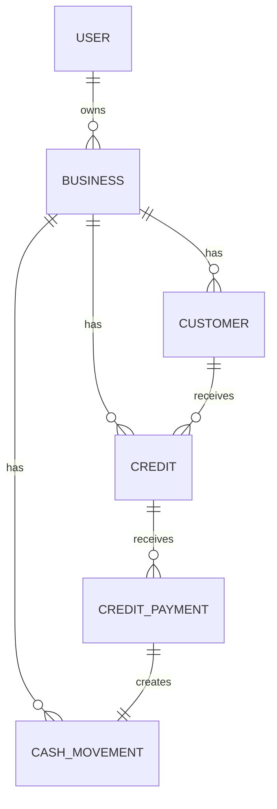

# 06 - Modelo de Datos

## Estado del documento

**Módulo:** Modelo de datos  
**Estado:** Propuesta inicial para validación  
**Proyecto:** Aplicación móvil para gestión básica de pequeños negocios  
**Metodología:** Spec Driven Development (SDD)  
**Documento anterior:** `05-modo-offline-y-sincronizacion.md`  
**Documento siguiente sugerido:** `07-arquitectura-y-stack-tecnico.md`

---

# Parte 1: Enfoque funcional / no técnico

## 1. Propósito

Este documento define cómo se organiza la información principal de la aplicación.

El modelo debe permitir que:

- Cada usuario tenga uno o varios negocios.
- Cada negocio mantenga sus datos separados.
- El usuario registre ventas, gastos, clientes, fiados y abonos.
- Los reportes se calculen con información consistente.
- La aplicación funcione con SQLite sin internet.
- Los datos puedan respaldarse y sincronizarse con PostgreSQL.
- La arquitectura pueda evolucionar más adelante hacia módulos o microservicios.

---

## 2. Objetos principales del sistema

La aplicación manejará inicialmente los siguientes conceptos:

- Usuario.
- Negocio.
- Cliente.
- Movimiento de caja.
- Fiado.
- Abono.
- Operación pendiente de sincronización.
- Estado de sincronización.

---

## 3. Relación general

```txt
Usuario
  └── tiene uno o varios Negocios
        ├── tiene Clientes
        ├── tiene Movimientos de caja
        │     ├── Venta
        │     ├── Gasto
        │     └── Entrada por abono
        └── tiene Fiados
              └── tiene Abonos
```

---

## 4. Usuario

Representa a la persona autenticada.

La autenticación será administrada por Better Auth.

El usuario podrá autenticarse mediante:

- Correo y contraseña.
- Google.

La información de autenticación no debe mezclarse con la información financiera del negocio.

### Datos funcionales básicos

- Identificador.
- Nombre.
- Correo.
- Imagen de perfil, si existe.
- Fecha de creación.

---

## 5. Negocio

Representa una tienda, emprendimiento o actividad económica administrada por el usuario.

Ejemplos:

- Tienda La 20.
- Miscelánea El Progreso.
- Puesto de comidas.
- Venta de productos por catálogo.

### Datos básicos

- Nombre.
- Tipo de negocio.
- Moneda.
- Zona horaria.
- Estado.
- Propietario.

### Reglas

- Un usuario puede tener varios negocios.
- Un negocio tiene un único propietario en el MVP.
- Los datos de un negocio no se mezclan con los de otro.
- Un negocio inactivo no permite registrar nuevas operaciones.
- El soporte para varios miembros por negocio queda fuera del MVP.

---

## 6. Cliente

Representa a una persona a la que el negocio le permite comprar fiado.

### Datos básicos

- Nombre.
- Teléfono opcional.
- Notas opcionales.
- Negocio al que pertenece.

### Reglas

- Un cliente pertenece a un solo negocio.
- El mismo cliente puede existir en dos negocios diferentes.
- Un cliente puede tener varios fiados.
- Un cliente con fiados activos no debe eliminarse físicamente.
- Un cliente puede desactivarse.

---

## 7. Movimiento de caja

Representa dinero que realmente entró o salió del negocio.

### Tipos

- Venta de contado.
- Gasto.
- Entrada por abono de fiado.

### Datos básicos

- Tipo.
- Monto.
- Fecha del negocio.
- Hora de registro.
- Nota.
- Categoría opcional.
- Estado.
- Negocio.

### Reglas

- Un movimiento siempre pertenece a un negocio.
- El monto debe ser mayor que cero.
- El tipo determina si el dinero entra o sale.
- Los movimientos anulados no afectan reportes.
- Un movimiento financiero no se elimina físicamente.

---

## 8. Fiado

Representa una deuda adquirida por un cliente.

### Datos básicos

- Cliente.
- Negocio.
- Monto inicial.
- Descripción opcional.
- Fecha del fiado.
- Estado.

### Estados

- Pendiente.
- Pagado.
- Cancelado.

### Reglas

- Un fiado nuevo no representa dinero recibido.
- Un fiado puede recibir varios abonos.
- El saldo se calcula restando los abonos activos.
- Un fiado pasa a pagado cuando el saldo llega a cero.
- Un fiado cancelado no afecta el total por cobrar.

---

## 9. Abono

Representa un pago parcial o total realizado por un cliente a un fiado.

### Datos básicos

- Fiado.
- Cliente.
- Negocio.
- Monto.
- Fecha del abono.
- Nota opcional.
- Estado.

### Reglas

- Un abono reduce el saldo del fiado.
- Un abono también genera una entrada de caja.
- Un abono no puede superar el saldo pendiente en el MVP.
- Un abono cancelado no reduce deuda ni suma a caja.
- La creación del abono y de su movimiento de caja debe ser atómica.

---

## 10. Reportes derivados

Los siguientes datos no se guardarán como tablas principales:

- Resumen del día.
- Resumen semanal.
- Total por cobrar.
- Saldo de un fiado.
- Total que debe un cliente.
- Deudas antiguas.

Se calcularán a partir de:

- Movimientos de caja.
- Fiados.
- Abonos.

Esto evita inconsistencias por guardar resultados duplicados.

---

## 11. Separación de información

Toda información financiera debe quedar asociada a:

```txt
Usuario
  ↓
Negocio
  ↓
Entidad financiera
```

El backend debe validar siempre que el usuario autenticado tenga acceso al negocio solicitado.

La aplicación local también debe filtrar la información por usuario y negocio.

---

## 12. Montos

Los montos se almacenarán como números enteros.

Para el MVP:

```txt
15000 representa $15.000 COP
```

No se usarán números decimales de punto flotante para valores financieros.

### Reglas

- El monto debe ser mayor que cero.
- La moneda predeterminada será COP.
- Un negocio tendrá una única moneda.
- Los reportes no mezclarán monedas.

---

## 13. Fechas

Se manejarán dos conceptos:

### Fecha del negocio

Representa el día al que pertenece la operación.

Ejemplo:

```txt
2026-07-11
```

Se usa para:

- Resumen diario.
- Historial.
- Reportes semanales.
- Antigüedad de fiados.

### Fecha técnica

Representa cuándo se creó o actualizó el registro.

Ejemplo:

```txt
2026-07-11T15:30:00Z
```

Se usa para:

- Auditoría.
- Sincronización.
- Control de versiones.

---

## 14. Estados y anulaciones

Las operaciones financieras se anulan en lugar de eliminarse.

Ejemplo:

```txt
Venta registrada por error
  ↓
Estado: CANCELLED
  ↓
No afecta reportes
```

Esto permite:

- Mantener historial.
- Evitar pérdida de trazabilidad.
- Simplificar sincronización.
- Reducir conflictos.

---

## 15. Identificadores

Cada registro sincronizable tendrá un identificador único generado en el cliente.

Se utilizará UUID.

Ejemplo:

```txt
3b4a3f5e-8c82-4d70-a851-e240f74c4f72
```

El mismo identificador se usará en SQLite y PostgreSQL.

---

# Parte 2: Enfoque técnico

## 16. Tecnologías

| Componente | Tecnología |
|---|---|
| Aplicación móvil | React Native + Expo |
| Base local | SQLite |
| Base remota | PostgreSQL |
| ORM | Drizzle |
| Backend | Hono |
| Autenticación | Better Auth |

---

## 17. Convenciones generales

### 17.1 Nombres

Las tablas usarán nombres en inglés y plural:

```txt
businesses
customers
cash_movements
credits
credit_payments
```

Los campos usarán `snake_case` en base de datos.

El código TypeScript podrá usar `camelCase`.

---

### 17.2 Campos comunes

Las entidades sincronizables incluirán:

```ts
interface BaseEntity {
  id: string;
  userId: string;
  createdAt: string;
  updatedAt: string;
  deletedAt?: string | null;
  version: number;
}
```

Las entidades financieras también incluirán `businessId`.

---

### 17.3 Versionado

`version` será un entero controlado por el servidor.

Regla:

```txt
Nuevo registro remoto: version = 1
Actualización aceptada: version = version + 1
```

El cliente enviará la versión base cuando actualice datos descriptivos.

---

## 18. Tablas administradas por Better Auth

Better Auth administrará sus propias tablas, por ejemplo:

- `user`
- `session`
- `account`
- `verification`

Los nombres exactos dependerán de la configuración y del adaptador usado.

### Regla

No se debe duplicar información sensible de autenticación en tablas propias.

La aplicación usará el identificador de usuario generado por Better Auth para relacionar negocios y datos.

---

## 19. Tabla `businesses`

```txt
businesses
```

### Propósito

Almacena los negocios creados por los usuarios.

### Campos

| Campo | Tipo lógico | Requerido | Descripción |
|---|---|---:|---|
| id | UUID/Text | Sí | Identificador |
| owner_user_id | Text | Sí | Usuario propietario |
| name | Text | Sí | Nombre del negocio |
| business_type | Text | No | Tipo de negocio |
| currency_code | Text | Sí | Moneda, por defecto COP |
| timezone | Text | Sí | Zona horaria |
| status | Text | Sí | ACTIVE o INACTIVE |
| created_at | Timestamp | Sí | Creación |
| updated_at | Timestamp | Sí | Última actualización |
| deleted_at | Timestamp | No | Eliminación lógica |
| version | Integer | Sí | Versión remota |

### Restricciones

- `name` no puede estar vacío.
- `currency_code` debe tener 3 caracteres.
- `status` solo acepta valores definidos.
- `owner_user_id` debe existir en Better Auth.

---

## 20. Tabla `customers`

### Propósito

Almacena clientes de fiado por negocio.

### Campos

| Campo | Tipo lógico | Requerido | Descripción |
|---|---|---:|---|
| id | UUID/Text | Sí | Identificador |
| user_id | Text | Sí | Dueño de los datos |
| business_id | UUID/Text | Sí | Negocio |
| name | Text | Sí | Nombre |
| phone | Text | No | Teléfono |
| notes | Text | No | Observaciones |
| status | Text | Sí | ACTIVE o INACTIVE |
| created_at | Timestamp | Sí | Creación |
| updated_at | Timestamp | Sí | Actualización |
| deleted_at | Timestamp | No | Eliminación lógica |
| version | Integer | Sí | Versión |

### Restricciones

- `name` no puede estar vacío.
- `business_id` debe existir.
- El usuario debe ser propietario del negocio.

---

## 21. Tabla `cash_movements`

### Propósito

Almacena entradas y salidas reales de dinero.

### Campos

| Campo | Tipo lógico | Requerido | Descripción |
|---|---|---:|---|
| id | UUID/Text | Sí | Identificador |
| user_id | Text | Sí | Dueño de los datos |
| business_id | UUID/Text | Sí | Negocio |
| type | Text | Sí | SALE, EXPENSE o CREDIT_PAYMENT |
| amount | BigInt/Integer | Sí | Monto en pesos |
| category | Text | No | Categoría |
| note | Text | No | Nota |
| business_date | Date/Text | Sí | Día de la operación |
| occurred_at | Timestamp | Sí | Momento de la operación |
| status | Text | Sí | ACTIVE o CANCELLED |
| source_type | Text | No | Tipo de entidad origen |
| source_id | UUID/Text | No | ID de entidad origen |
| cancellation_reason | Text | No | Motivo de anulación |
| cancelled_at | Timestamp | No | Fecha de anulación |
| created_at | Timestamp | Sí | Creación |
| updated_at | Timestamp | Sí | Actualización |
| version | Integer | Sí | Versión |

### Restricciones

- `amount > 0`.
- `type` debe ser válido.
- Si `type = CREDIT_PAYMENT`, debe existir `source_id`.
- Los movimientos anulados no se eliminan.
- `source_type + source_id` debe ser único cuando exista.

---

## 22. Tabla `credits`

### Propósito

Almacena fiados registrados a clientes.

### Campos

| Campo | Tipo lógico | Requerido | Descripción |
|---|---|---:|---|
| id | UUID/Text | Sí | Identificador |
| user_id | Text | Sí | Dueño |
| business_id | UUID/Text | Sí | Negocio |
| customer_id | UUID/Text | Sí | Cliente |
| original_amount | BigInt/Integer | Sí | Monto inicial |
| description | Text | No | Descripción |
| credit_date | Date/Text | Sí | Fecha del fiado |
| status | Text | Sí | PENDING, PAID o CANCELLED |
| cancellation_reason | Text | No | Motivo |
| paid_at | Timestamp | No | Fecha de pago completo |
| cancelled_at | Timestamp | No | Fecha de cancelación |
| created_at | Timestamp | Sí | Creación |
| updated_at | Timestamp | Sí | Actualización |
| version | Integer | Sí | Versión |

### Restricciones

- `original_amount > 0`.
- El cliente debe pertenecer al negocio.
- Un fiado pagado no puede recibir nuevos abonos.
- Un fiado cancelado no puede recibir abonos.

---

## 23. Tabla `credit_payments`

### Propósito

Almacena abonos realizados a fiados.

### Campos

| Campo | Tipo lógico | Requerido | Descripción |
|---|---|---:|---|
| id | UUID/Text | Sí | Identificador |
| user_id | Text | Sí | Dueño |
| business_id | UUID/Text | Sí | Negocio |
| credit_id | UUID/Text | Sí | Fiado |
| customer_id | UUID/Text | Sí | Cliente |
| cash_movement_id | UUID/Text | Sí | Entrada de caja asociada |
| amount | BigInt/Integer | Sí | Monto |
| payment_date | Date/Text | Sí | Fecha del abono |
| note | Text | No | Nota |
| status | Text | Sí | ACTIVE o CANCELLED |
| cancellation_reason | Text | No | Motivo |
| cancelled_at | Timestamp | No | Fecha de cancelación |
| created_at | Timestamp | Sí | Creación |
| updated_at | Timestamp | Sí | Actualización |
| version | Integer | Sí | Versión |

### Restricciones

- `amount > 0`.
- `cash_movement_id` debe ser único.
- El fiado, cliente y negocio deben coincidir.
- El abono no puede superar el saldo pendiente.
- Crear el abono y el movimiento debe ocurrir en la misma transacción.

---

## 24. Tabla local `sync_outbox`

Esta tabla existe en SQLite.

### Propósito

Guarda operaciones pendientes de enviar al servidor.

### Campos

| Campo | Tipo lógico | Descripción |
|---|---|---|
| operation_id | UUID/Text | ID idempotente |
| user_id | Text | Usuario |
| business_id | UUID/Text | Negocio opcional |
| entity_type | Text | Tipo de entidad |
| entity_id | UUID/Text | ID de entidad |
| operation | Text | CREATE, UPDATE, CANCEL o DELETE |
| payload | JSON/Text | Datos enviados |
| base_version | Integer | Versión conocida |
| status | Text | PENDING, PROCESSING, SYNCED, FAILED o CONFLICT |
| attempts | Integer | Número de intentos |
| last_error | Text | Último error |
| next_retry_at | Timestamp | Próximo intento |
| created_at | Timestamp | Creación |
| updated_at | Timestamp | Actualización |

---

## 25. Tabla local `sync_state`

Esta tabla existe en SQLite.

### Propósito

Guarda el estado general de sincronización de un usuario.

### Campos

| Campo | Tipo lógico | Descripción |
|---|---|---|
| user_id | Text | Usuario |
| last_cursor | Text | Último cursor aplicado |
| last_successful_sync_at | Timestamp | Última sincronización exitosa |
| last_attempt_at | Timestamp | Último intento |
| last_error | Text | Último error |

---

## 26. Tabla remota `processed_sync_operations`

Esta tabla existe en PostgreSQL.

### Propósito

Evita duplicados cuando una operación se reenvía.

### Campos

| Campo | Tipo lógico | Descripción |
|---|---|---|
| operation_id | UUID/Text | Identificador único |
| user_id | Text | Usuario |
| entity_type | Text | Entidad |
| entity_id | UUID/Text | Registro |
| result | JSONB | Resultado devuelto |
| processed_at | Timestamp | Fecha de procesamiento |

---

## 27. Tabla remota `sync_change_log`

Esta tabla existe en PostgreSQL.

### Propósito

Permite descargar cambios de forma incremental.

### Campos

| Campo | Tipo lógico | Descripción |
|---|---|---|
| change_id | BigSerial | Cursor |
| user_id | Text | Usuario |
| business_id | UUID/Text | Negocio |
| entity_type | Text | Entidad |
| entity_id | UUID/Text | Registro |
| operation | Text | Tipo de cambio |
| version | Integer | Versión |
| changed_at | Timestamp | Fecha |

---

## 28. Tablas que no se crearán en el MVP

No se crearán tablas separadas para:

- Resumen diario.
- Resumen semanal.
- Total por cobrar.
- Saldo de cliente.
- Saldo de fiado.
- Deuda antigua.

Estos valores se calculan.

---

## 29. Relaciones



---

## 30. Integridad referencial

### Reglas

- No se puede crear un cliente para un negocio inexistente.
- No se puede crear un fiado para un cliente de otro negocio.
- No se puede crear un abono para un fiado de otro cliente.
- No se puede crear un movimiento para un negocio ajeno.
- Un abono debe apuntar a una entrada de caja válida.
- El servidor siempre valida estas reglas aunque el cliente ya las haya validado.

---

## 31. Índices recomendados

### `businesses`

```txt
owner_user_id
owner_user_id + status
```

### `customers`

```txt
business_id
business_id + name
business_id + status
```

### `cash_movements`

```txt
business_id + business_date
business_id + type + business_date
business_id + status + business_date
source_type + source_id
```

### `credits`

```txt
business_id + status
customer_id + status
business_id + credit_date
```

### `credit_payments`

```txt
credit_id + status
customer_id + payment_date
business_id + payment_date
cash_movement_id UNIQUE
```

### Sincronización

```txt
sync_outbox.status + next_retry_at
sync_change_log.user_id + change_id
processed_sync_operations.operation_id UNIQUE
```

---

## 32. Consultas derivadas principales

### Saldo de un fiado

```txt
saldo = original_amount - suma(abonos activos)
```

### Total por cobrar

```txt
total = suma(saldos de fiados pendientes)
```

### Entradas del día

```txt
ventas activas + abonos activos
```

### Salidas del día

```txt
gastos activos
```

### Quedó

```txt
entradas - salidas
```

---

## 33. Ejemplo conceptual con Drizzle para PostgreSQL

```ts
import {
  pgTable,
  text,
  bigint,
  integer,
  timestamp,
  date,
  uniqueIndex,
  index,
} from "drizzle-orm/pg-core";

export const businesses = pgTable(
  "businesses",
  {
    id: text("id").primaryKey(),
    ownerUserId: text("owner_user_id").notNull(),
    name: text("name").notNull(),
    businessType: text("business_type"),
    currencyCode: text("currency_code").notNull().default("COP"),
    timezone: text("timezone").notNull().default("America/Bogota"),
    status: text("status").notNull().default("ACTIVE"),
    version: integer("version").notNull().default(1),
    createdAt: timestamp("created_at", { withTimezone: true }).notNull(),
    updatedAt: timestamp("updated_at", { withTimezone: true }).notNull(),
    deletedAt: timestamp("deleted_at", { withTimezone: true }),
  },
  (table) => ({
    ownerIdx: index("businesses_owner_idx").on(table.ownerUserId),
  }),
);

export const cashMovements = pgTable(
  "cash_movements",
  {
    id: text("id").primaryKey(),
    userId: text("user_id").notNull(),
    businessId: text("business_id").notNull(),
    type: text("type").notNull(),
    amount: bigint("amount", { mode: "number" }).notNull(),
    category: text("category"),
    note: text("note"),
    businessDate: date("business_date").notNull(),
    occurredAt: timestamp("occurred_at", { withTimezone: true }).notNull(),
    status: text("status").notNull().default("ACTIVE"),
    sourceType: text("source_type"),
    sourceId: text("source_id"),
    version: integer("version").notNull().default(1),
    createdAt: timestamp("created_at", { withTimezone: true }).notNull(),
    updatedAt: timestamp("updated_at", { withTimezone: true }).notNull(),
  },
  (table) => ({
    businessDateIdx: index("cash_movements_business_date_idx").on(
      table.businessId,
      table.businessDate,
    ),
    sourceUnique: uniqueIndex("cash_movements_source_unique").on(
      table.sourceType,
      table.sourceId,
    ),
  }),
);
```

---

## 34. Ejemplo conceptual con Drizzle para SQLite

```ts
import {
  sqliteTable,
  text,
  integer,
  index,
} from "drizzle-orm/sqlite-core";

export const localBusinesses = sqliteTable(
  "businesses",
  {
    id: text("id").primaryKey(),
    ownerUserId: text("owner_user_id").notNull(),
    name: text("name").notNull(),
    businessType: text("business_type"),
    currencyCode: text("currency_code").notNull().default("COP"),
    timezone: text("timezone").notNull().default("America/Bogota"),
    status: text("status").notNull().default("ACTIVE"),
    version: integer("version").notNull().default(0),
    createdAt: text("created_at").notNull(),
    updatedAt: text("updated_at").notNull(),
    deletedAt: text("deleted_at"),
  },
  (table) => ({
    ownerIdx: index("businesses_owner_idx").on(table.ownerUserId),
  }),
);
```

---

## 35. Diferencias entre SQLite y PostgreSQL

Las tablas tendrán el mismo significado, pero no necesariamente tipos idénticos.

Ejemplo:

| Concepto | SQLite | PostgreSQL |
|---|---|---|
| UUID | TEXT | TEXT o UUID |
| Fecha | TEXT ISO-8601 | DATE/TIMESTAMP |
| JSON | TEXT | JSONB |
| Boolean | INTEGER 0/1 | BOOLEAN |
| Monto | INTEGER | BIGINT |

La lógica de dominio debe ser igual en ambos lados.

---

## 36. Transacción para registrar un abono

Debe ocurrir en una sola transacción local:

```txt
BEGIN

1. Validar saldo pendiente
2. Crear credit_payment
3. Crear cash_movement CREDIT_PAYMENT
4. Insertar operaciones en sync_outbox
5. Recalcular estado del fiado
6. Actualizar credit si queda pagado

COMMIT
```

Si algún paso falla:

```txt
ROLLBACK
```

---

## 37. Estado del fiado

El estado puede derivarse del saldo, pero se guardará para facilitar consultas.

Reglas:

```txt
saldo > 0 y no cancelado → PENDING
saldo = 0 → PAID
cancelado → CANCELLED
```

El backend debe verificar que el estado coincida con los abonos.

---

## 38. Eliminación lógica

### Entidades descriptivas

Podrán usar `deleted_at`:

- Negocios.
- Clientes.

### Entidades financieras

Usarán estado:

- `cash_movements.status`
- `credits.status`
- `credit_payments.status`

No se eliminarán físicamente.

---

## 39. Datos de sincronización

La metadata de sincronización no debe mezclarse innecesariamente con las tablas de dominio.

Decisión:

- `version` sí pertenece a la entidad.
- El estado `PENDING`, `FAILED` o `CONFLICT` vive en `sync_outbox`.
- PostgreSQL no necesita `sync_status` en cada registro.
- SQLite puede determinar si un registro está pendiente buscando operaciones activas en `sync_outbox`.

Esta decisión reemplaza propuestas anteriores que incluían `sync_status` dentro de todas las entidades.

---

## 40. Datos sensibles

No se almacenarán en SQLite:

- Contraseñas.
- Secretos OAuth.
- Credenciales de Google.
- Claves privadas.

Las cookies o credenciales de sesión se guardarán usando almacenamiento seguro compatible con Expo.

---

## 41. Migraciones

### SQLite

Las migraciones deben ejecutarse al iniciar la aplicación antes de usar los repositorios.

### PostgreSQL

Las migraciones deben ejecutarse durante despliegue o arranque controlado del backend.

### Reglas

- No modificar tablas manualmente en producción.
- Toda modificación debe tener migración.
- Las migraciones deben ser versionadas en Git.
- Los cambios destructivos deben planificarse para no perder datos locales.

---

## 42. Preparación para microservicios

El modelo se organiza por dominios:

```txt
Autenticación
Negocios
Caja
Crédito
Reportes
Sincronización
```

En el MVP pueden compartir PostgreSQL dentro de un monolito modular en Hono.

En el futuro, si se separan en microservicios:

- Cada servicio deberá ser dueño de sus tablas.
- No se compartirán escrituras directas entre servicios.
- Las referencias entre servicios podrán manejarse por identificadores y eventos.
- La separación se hará solo cuando exista una necesidad real.

---

## 43. Criterios de aceptación

### CA-001: Separación por negocio

Dado un usuario con dos negocios,

Cuando consulta movimientos de uno,

Entonces no aparecen movimientos del otro.

---

### CA-002: Abono consistente

Dado un fiado pendiente,

Cuando se registra un abono,

Entonces:

- Se crea el abono.
- Se crea una entrada de caja.
- Ambos apuntan al mismo negocio y cliente.
- El saldo se reduce correctamente.

---

### CA-003: Operación atómica

Dado que falla la creación del movimiento de caja,

Cuando se intenta registrar un abono,

Entonces no queda creado el abono.

---

### CA-004: Anulación

Dado un movimiento anulado,

Cuando se calcula el resumen,

Entonces no afecta entradas ni salidas.

---

### CA-005: Total por cobrar

Dado un fiado de $50.000 y abonos activos por $20.000,

Cuando se consulta el saldo,

Entonces el resultado es $30.000.

---

### CA-006: IDs compartidos

Dado un registro creado offline,

Cuando se sincroniza,

Entonces conserva el mismo ID en SQLite y PostgreSQL.

---

### CA-007: No duplicar reportes

Dado que existe información financiera,

Cuando se consulta un resumen,

Entonces se calcula desde movimientos, fiados y abonos sin depender de una tabla de resumen.

---

## 44. Decisiones pendientes

- Confirmar si se usará `UUID v4`, `UUID v7` o ULID.
- Confirmar si PostgreSQL usará tipo nativo `UUID` o `TEXT`.
- Definir catálogo inicial de categorías de gasto.
- Definir si los negocios tendrán logo.
- Definir si los clientes podrán fusionarse cuando existan duplicados.
- Definir política de retención para `sync_change_log`.
- Definir si el soporte multiusuario por negocio se implementará en una fase posterior.
- Definir si se requiere cifrado local de SQLite.

---

## 45. Definición de terminado

El modelo de datos se considera definido cuando:

- Todas las entidades principales tienen campos claros.
- Las relaciones están documentadas.
- Las reglas de integridad están definidas.
- Los montos no usan punto flotante.
- Los reportes se calculan desde datos fuente.
- El abono y su entrada de caja son atómicos.
- SQLite y PostgreSQL comparten los mismos identificadores.
- La metadata de sincronización está separada del dominio.
- El modelo soporta varios negocios por usuario.
- El modelo está preparado para evolucionar sin introducir microservicios prematuramente.
